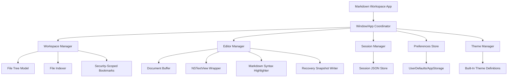
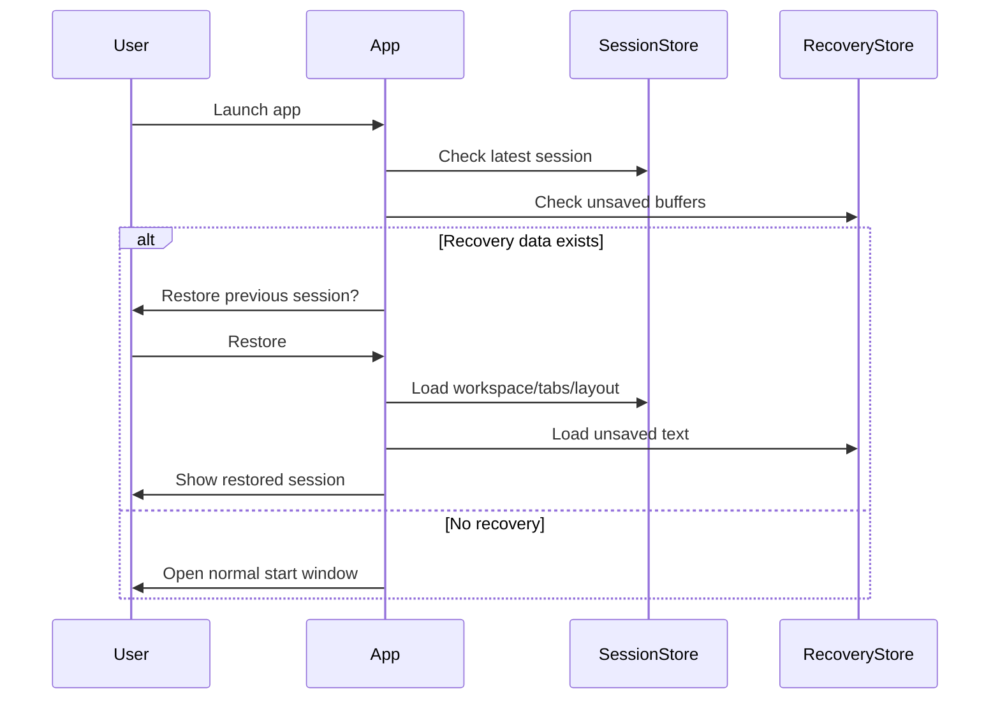

# macOS Markdown Workspace v1 — Expert Architecture & Agentic Development Plan

> **Goal:** Build a release-ready, local-first, lightweight plain-text workspace for macOS Tahoe, focused on Markdown writing, notes, documentation, scratchpads, and prompt/workflow text.

---

## 0. Executive Recommendation

Build this as a **native macOS app** using:

| Layer | Recommendation |
|---|---|
| Language | **Swift 6+** |
| UI | **SwiftUI** for app shell, sidebar, settings, menus |
| Editor | **AppKit `NSTextView` / TextKit** wrapped in SwiftUI |
| File system | `FileManager`, security-scoped bookmarks, optional file watching |
| Persistence | JSON files in Application Support + `UserDefaults`/`AppStorage` |
| Build | Xcode + Swift Package Manager |
| Testing | XCTest, XCUITest, manual crash-recovery tests |
| Distribution | Developer ID notarized `.dmg` first; App Store optional later |

Do **not** start with Electron, Tauri, WYSIWYG, plugins, AI, Pandoc, or live preview. Those are excellent later features, but for v1 the winning strategy is:

> **Make opening folders, editing Markdown, saving safely, navigating quickly, and restoring sessions extremely reliable.**

---

# 1. Product Definition

## 1.1 Product Positioning

A fast native macOS Markdown workspace that opens folders, lets users edit plain-text files directly, restores the entire session after quit or crash, and gives writers/developers a focused configurable editing environment.

Think:

- Lightweight like a native text editor.
- Workspace-oriented like VS Code or Obsidian.
- Writing-focused like iA Writer.
- Local-first and plain-text by default.

## 1.2 Target Users

Primary:

- Writers
- Developers
- Technical documentation authors
- Prompt engineers
- Note takers
- People who live in Markdown files and folders

## 1.3 v1 Promise

The v1 should confidently answer:

> “Can I open a folder full of Markdown files, edit them quickly, switch between files, quit/crash safely, reopen, and continue exactly where I left off?”

If yes, you have a strong v1.

---

# 2. v1 Scope

## 2.1 Mandatory v1 Features

| Feature | v1 Requirement | Implementation Direction |
|---|---|---|
| Source Mode | Raw Markdown editing | `NSTextView` with Markdown syntax highlighting |
| Markdown/Text Open/Edit/Save | Open `.md`, `.markdown`, `.txt`, plain text | Direct file I/O with dirty-state tracking |
| Open Folders as Workspaces | Treat folder as project | Folder picker + security-scoped bookmark |
| File Tree Sidebar | Browse workspace files | Recursive/lazy file tree |
| Quick File Switching | Jump efficiently | `⌘P` fuzzy finder |
| Recent Files | Resume quickly | Recent files/workspaces store |
| Session Recovery / Hot Exit | Restore tabs, unsaved changes, cursors, layout, window state | JSON session snapshots + recovery buffers |
| Themes | Built-in themes | Theme model applied to editor/sidebar |
| Font Controls | Font family and size | Preferences panel |
| Layout Controls | Line height, spacing, width, alignment | Editor layout settings |

## 2.2 Explicitly Defer Until After v1

Do **not** implement these until the core app is stable:

- Live Markdown preview
- WYSIWYG mode
- Visual Markdown editing
- Plugin system
- AI tools
- MCP integration
- Terminal integration
- Coding-agent integration
- Pandoc export
- Full custom theme editor
- Complex Markdown AST editing

These can become v1.5/v2 features.

---

# 3. Technology Decision

## 3.1 Recommended Stack

```text
App Platform:        macOS Tahoe
Language:            Swift 6+
UI Framework:        SwiftUI
Editor Core:         AppKit NSTextView / TextKit bridge
Persistence:         Codable JSON + UserDefaults/AppStorage
File Access:         FileManager + security-scoped bookmarks
File Watching:       FSEvents or DispatchSource, optional for v1
Build System:        Xcode + Swift Package Manager
Testing:             XCTest + XCUITest
Distribution:        Developer ID notarization + DMG
```

## 3.2 Why Native Swift Instead of Electron/Tauri?

| Option | Pros | Cons | Verdict |
|---|---|---|---|
| Native SwiftUI/AppKit | Best macOS feel, low memory, excellent file access, great text rendering | Requires Apple-specific knowledge | **Best choice** |
| Electron | Huge ecosystem, easy web UI | Heavy, non-native, memory-hungry | Avoid for “lightweight” app |
| Tauri | Lighter than Electron | Still bridge-heavy, web editor complexity | Possible, not ideal |
| Pure SwiftUI `TextEditor` | Simple | Too limited for syntax highlighting/layout | Avoid for editor core |
| AppKit-only | Maximum control | Slower UI development | Use only where needed |

## 3.3 Editor Recommendation

Use:

```swift
NSTextView
NSTextStorage
NSLayoutManager
NSTextContainer
NSScrollView
```

wrapped with:

```swift
NSViewRepresentable
```

Why:

- Better performance than SwiftUI `TextEditor`
- Syntax highlighting support
- Selection/cursor control
- Scroll position restore
- Font/layout customization
- Future support for line numbers, minimap, visual mode, etc.

Optional later:

- [`STTextView`](https://github.com/krzyzanowskim/STTextView)
- [`tree-sitter`](https://tree-sitter.github.io/tree-sitter/) for advanced Markdown parsing
- [`Highlightr`](https://github.com/raspu/Highlightr) for syntax highlighting experimentation

For v1, a custom lightweight Markdown highlighter is enough.

---

# 4. High-Level Architecture



---

# 5. Core Modules

## 5.1 App Shell

Responsible for:

- Main window
- Menus
- Commands
- Keyboard shortcuts
- App lifecycle
- Opening files/folders
- Preferences window

Suggested files:

```text
App/
├── MarkdownWorkspaceApp.swift
├── AppDelegate.swift
├── AppCommands.swift
└── MainWindowView.swift
```

## 5.2 Workspace Manager

Responsible for:

- Opening a folder as a workspace
- Persisting access to workspace folders
- Loading file tree
- Filtering visible files
- Indexing files for quick switcher
- Tracking current workspace

Important details:

- Use security-scoped bookmarks if sandboxed.
- Ignore hidden/system/build folders by default:
  - `.git`
  - `.DS_Store`
  - `node_modules`
  - `.build`
  - `DerivedData`
  - `.obsidian` optionally visible later
- Support at least:
  - `.md`
  - `.markdown`
  - `.txt`

## 5.3 Document Manager

Responsible for:

- Opening files
- Reading text
- Tracking dirty state
- Saving safely
- Handling external file changes
- Managing tabs/open documents

Document states:

```swift
enum DocumentSaveState: Codable {
    case clean
    case dirty
    case conflicted
    case deletedOnDisk
}
```

## 5.4 Editor Manager

Responsible for:

- Current tab
- Cursor position
- Scroll position
- Selection
- Editor settings
- Applying syntax highlighting
- Undo/redo integration

## 5.5 Session Manager

Responsible for hot exit and crash recovery.

Must persist:

- Open workspace URL/bookmark
- Open tabs
- Active tab
- Unsaved buffers
- Cursor positions
- Scroll positions
- Window frame
- Sidebar width
- Editor layout settings
- Theme
- Recently opened files/workspaces

## 5.6 Theme Manager

Responsible for:

- Built-in themes
- Editor colors
- Sidebar colors
- Syntax token colors
- Font color/background
- Selection color

v1 built-in themes:

1. System
2. Light
3. Dark
4. Writer / Paper
5. Developer / Code
6. High Contrast

---

# 6. Suggested Project Structure

Use feature-oriented structure so AI agents can reason about boundaries.

```text
MarkdownWorkspace/
├── App/
│   ├── MarkdownWorkspaceApp.swift
│   ├── AppDelegate.swift
│   ├── AppCommands.swift
│   └── MainWindowView.swift
│
├── Domain/
│   ├── Workspace.swift
│   ├── FileNode.swift
│   ├── DocumentBuffer.swift
│   ├── AppSession.swift
│   ├── Theme.swift
│   └── EditorSettings.swift
│
├── Services/
│   ├── WorkspaceManager.swift
│   ├── FileTreeBuilder.swift
│   ├── FileIndexer.swift
│   ├── DocumentManager.swift
│   ├── SessionManager.swift
│   ├── RecentFilesManager.swift
│   ├── BookmarkManager.swift
│   └── ThemeManager.swift
│
├── Editor/
│   ├── MarkdownTextViewRepresentable.swift
│   ├── MarkdownTextViewCoordinator.swift
│   ├── MarkdownHighlighter.swift
│   ├── EditorView.swift
│   └── EditorToolbar.swift
│
├── UI/
│   ├── Sidebar/
│   │   ├── FileTreeSidebarView.swift
│   │   ├── FileTreeRowView.swift
│   │   └── WorkspaceHeaderView.swift
│   ├── Tabs/
│   │   ├── TabBarView.swift
│   │   └── TabItemView.swift
│   ├── QuickSwitcher/
│   │   ├── QuickSwitcherView.swift
│   │   └── FuzzyMatcher.swift
│   ├── Settings/
│   │   ├── SettingsView.swift
│   │   ├── AppearanceSettingsView.swift
│   │   └── EditorSettingsView.swift
│   └── Components/
│
├── Persistence/
│   ├── ApplicationSupportPaths.swift
│   ├── JSONStore.swift
│   ├── SessionStore.swift
│   └── RecoveryBufferStore.swift
│
├── Utilities/
│   ├── AtomicFileWriter.swift
│   ├── Debouncer.swift
│   ├── FileTypeDetector.swift
│   └── Logger.swift
│
└── Tests/
    ├── UnitTests/
    ├── IntegrationTests/
    └── UITests/
```

---

# 7. Key Data Models

## 7.1 Workspace

```swift
struct Workspace: Codable, Identifiable, Equatable {
    var id: UUID
    var displayName: String
    var rootURL: URL
    var bookmarkData: Data?
    var lastOpenedAt: Date
}
```

## 7.2 File Node

```swift
struct FileNode: Identifiable, Hashable {
    let id: UUID
    let url: URL
    let name: String
    let isDirectory: Bool
    var children: [FileNode]?
}
```

## 7.3 Document Buffer

```swift
struct DocumentBuffer: Identifiable, Codable {
    var id: UUID
    var fileURL: URL
    var displayName: String
    var text: String
    var lastSavedTextHash: String
    var isDirty: Bool
    var cursorLocation: Int
    var selectedRangeLocation: Int
    var selectedRangeLength: Int
    var scrollOffsetY: Double
    var lastModifiedOnDisk: Date?
}
```

## 7.4 App Session

```swift
struct AppSession: Codable {
    var workspace: Workspace?
    var openFileURLs: [URL]
    var activeFileURL: URL?
    var unsavedBuffers: [RecoveredBuffer]
    var cursorPositions: [String: Int]
    var scrollPositions: [String: Double]
    var windowFrame: CodableRect?
    var sidebarWidth: Double
    var selectedThemeID: String
    var editorSettings: EditorSettings
    var savedAt: Date
}
```

## 7.5 Editor Settings

```swift
struct EditorSettings: Codable, Equatable {
    var fontFamily: String
    var fontSize: Double
    var lineHeightMultiple: Double
    var paragraphSpacing: Double
    var editorMaxWidth: Double
    var textAlignment: TextAlignmentOption
    var wrapsLines: Bool
    var showsInvisibles: Bool
}
```

---

# 8. UI/UX Blueprint

## 8.1 Main Layout

Recommended v1 layout:

```text
┌──────────────────────────────────────────────────────────────┐
│ Toolbar: Workspace Name | Quick Switch | Theme | Settings    │
├───────────────┬──────────────────────────────────────────────┤
│ File Sidebar  │ Tab Bar                                      │
│               ├──────────────────────────────────────────────┤
│ ▾ Notes       │                                              │
│   intro.md    │                Editor                        │
│   ideas.md    │                                              │
│ ▾ Docs        │      Raw Markdown source editing             │
│   api.md      │                                              │
│               │                                              │
└───────────────┴──────────────────────────────────────────────┘
```

Use `NavigationSplitView` or a custom split view.

## 8.2 Sidebar

Sidebar features for v1:

- Workspace name/header
- File tree
- Expand/collapse folders
- Click file to open
- Context menu:
  - New File
  - New Folder
  - Rename
  - Reveal in Finder
  - Delete / Move to Trash
- Filter supported text files
- Optional search field

## 8.3 Editor

Editor features for v1:

- Raw Markdown source mode
- Syntax highlighting
- Dirty indicator
- Save indicator
- Font/layout settings
- Cursor restore
- Scroll restore

Avoid adding preview pane until after v1.

## 8.4 Quick Switcher

Keyboard shortcut:

```text
⌘P
```

Behavior:

- Opens centered overlay
- Search indexed workspace files
- Fuzzy matching by filename and path
- Enter opens selected file
- Escape closes overlay

Example UI:

```text
┌───────────────────────────────────────┐
│ Open file...                          │
├───────────────────────────────────────┤
│ ideas/product-roadmap.md              │
│ docs/api/authentication.md            │
│ prompts/refactor-agent.md             │
└───────────────────────────────────────┘
```

## 8.5 Settings

Settings panels:

1. General
2. Editor
3. Appearance
4. Files
5. Advanced

v1 editor settings:

- Font family
- Font size
- Line height
- Paragraph/block spacing
- Editor width
- Text alignment
- Theme
- Show/hide line wrapping

---

# 9. Keyboard Shortcuts

| Action | Shortcut |
|---|---|
| Open Workspace | `⌘O` or `⇧⌘O` |
| Open File | `⌘O` |
| Save | `⌘S` |
| Save All | `⌥⌘S` |
| Quick Switcher | `⌘P` |
| New File | `⌘N` |
| Close Tab | `⌘W` |
| Next Tab | `⌘}` |
| Previous Tab | `⌘{` |
| Increase Font Size | `⌘+` |
| Decrease Font Size | `⌘-` |
| Reset Font Size | `⌘0` |
| Preferences | `⌘,` |
| Toggle Sidebar | `⌥⌘S` or `⌘\` |

---

# 10. File Safety Rules

This app’s reputation depends on never losing text.

## 10.1 Safe Save Process

When saving a file:

1. Encode text as UTF-8.
2. Write to temporary file in same directory.
3. Flush to disk.
4. Atomically replace original file.
5. Update dirty state only after successful write.
6. Update last-known modification date/hash.

Pseudo-flow:

```text
buffer text
   ↓
write temp file
   ↓
atomic replace original
   ↓
verify success
   ↓
mark clean
```

## 10.2 Dirty State

A document is dirty if:

```text
currentTextHash != lastSavedTextHash
```

Track:

- Last saved hash
- Last disk modification date
- Current buffer hash

## 10.3 External File Changes

If a file changes on disk while open:

- If buffer is clean: reload automatically or ask user.
- If buffer is dirty: mark conflicted and show options:
  - Keep my changes
  - Reload from disk
  - Save as copy
  - Compare later, optional post-v1

## 10.4 Deleted Files

If an open file is deleted externally:

- Keep buffer open.
- Mark tab as “deleted on disk”.
- Allow:
  - Save to recreate
  - Save As
  - Close without saving

---

# 11. Session Recovery / Hot Exit Design

This is one of your most important v1 features.

## 11.1 What to Persist

Save session snapshots containing:

- Workspace bookmark
- Open tabs
- Active tab
- Unsaved buffers
- Cursor positions
- Selection ranges
- Scroll positions
- Window frame
- Sidebar width
- Theme
- Editor layout settings

## 11.2 Where to Store

Use:

```text
~/Library/Application Support/YourAppName/
├── Sessions/
│   └── latest-session.json
├── Recovery/
│   ├── buffer-file-id-1.json
│   └── buffer-file-id-2.json
└── Preferences/
```

## 11.3 Snapshot Timing

Write recovery snapshots:

- On app launch after session load
- On file open/close
- On tab switch
- On cursor movement, debounced
- On text change, debounced every 1–3 seconds
- On app background
- On app termination
- On crash recovery next launch

## 11.4 Crash Recovery Flow



## 11.5 User Experience

On launch after crash:

```text
Your previous session was recovered.

[Restore Session] [Discard] [Review Files]
```

For a solo v1, “Restore Session” and “Discard” are enough.

---

# 12. Markdown Syntax Highlighting

## 12.1 v1 Highlighter Scope

Do simple source-mode highlighting:

- Headings
- Bold
- Italic
- Inline code
- Code fences
- Links
- Blockquotes
- Lists
- Horizontal rules
- HTML comments optional

You do **not** need perfect Markdown parsing for v1.

## 12.2 Recommended Implementation

Use `NSTextStorage` attributes and a debounced highlighter.

Pipeline:

```text
Text changed
   ↓
Debounce 100–250ms
   ↓
Identify changed paragraph/range
   ↓
Apply default attributes
   ↓
Apply Markdown token attributes
   ↓
Preserve cursor/selection
```

Avoid re-highlighting massive files on every keystroke.

## 12.3 Later Upgrade

For v1.5/v2:

- Use tree-sitter Markdown
- Add code block language highlighting
- Add inline preview styling
- Add live preview pane

---

# 13. Built-In Themes

## 13.1 Theme Model

```swift
struct Theme: Codable, Identifiable, Equatable {
    var id: String
    var name: String
    var editorBackground: String
    var editorForeground: String
    var sidebarBackground: String
    var selectionColor: String
    var cursorColor: String
    var headingColor: String
    var linkColor: String
    var codeColor: String
    var quoteColor: String
}
```

Store colors as hex strings for easy JSON serialization.

## 13.2 v1 Themes

Recommended built-ins:

| Theme | Purpose |
|---|---|
| System | Follows macOS appearance |
| Light | Neutral light |
| Dark | Neutral dark |
| Paper | Writer-focused warm theme |
| Midnight | Developer-focused dark theme |
| High Contrast | Accessibility |

---

# 14. Source Control Strategy

Use Git from day one.

## 14.1 Branching

For a solo developer:

```text
main
dev
feature/editor-core
feature/workspace-sidebar
feature/session-recovery
feature/quick-switcher
feature/themes
release/v1.0
```

Simpler alternative:

- `main` always stable
- short-lived feature branches
- merge only after tests/manual verification

## 14.2 Commit Style

Use conventional commits:

```text
feat: add workspace folder picker
feat: implement markdown syntax highlighting
fix: preserve cursor after highlighting
test: add session recovery tests
chore: configure swiftlint
```

## 14.3 Tags

```text
v0.1.0-scaffold
v0.2.0-workspace
v0.3.0-editor
v0.4.0-session
v0.5.0-alpha
v1.0.0
```

---

# 15. Agentic Development Workflow

Your team is one person plus AI. Treat the AI like a set of specialized agents.

## 15.1 Recommended AI Roles

Use separate prompts/conversations for:

| Agent | Responsibility |
|---|---|
| Product Architect | Scope, UX, roadmap, acceptance criteria |
| SwiftUI Engineer | Views, state management, navigation |
| AppKit Editor Engineer | `NSTextView`, highlighter, cursor/selection |
| macOS Filesystem Engineer | bookmarks, file tree, atomic saves |
| QA Engineer | test plans, edge cases, regression tests |
| Release Engineer | signing, notarization, DMG, changelog |

## 15.2 Daily Workflow

1. Pick one small feature.
2. Ask AI for a mini-spec.
3. Ask AI for implementation plan.
4. Generate code in small chunks.
5. Build locally.
6. Fix compile errors with AI.
7. Write/ask for tests.
8. Manually test.
9. Commit.
10. Update project notes.

## 15.3 Agent Prompt Template

Use prompts like this:

```markdown
You are a senior macOS Swift engineer.

Context:
- Native macOS app
- SwiftUI shell
- AppKit NSTextView editor
- Local-first Markdown workspace
- v1 must be reliable and lightweight

Task:
Implement [specific feature].

Constraints:
- No Electron/Tauri
- Avoid over-engineering
- Keep code testable
- Use Codable JSON for persistence
- Preserve existing architecture

Files involved:
- [list files]

Acceptance criteria:
- [clear bullet list]

Return:
1. Implementation plan
2. Code changes
3. Edge cases
4. Tests
```

## 15.4 Example Prompt: Workspace Opening

```markdown
Implement workspace folder opening for a sandboxed macOS SwiftUI app.

Requirements:
- Show NSOpenPanel configured for directories only.
- Store a security-scoped bookmark for the selected folder.
- Build a recursive file tree containing .md, .markdown, and .txt files.
- Ignore .git, node_modules, .DS_Store, and hidden files by default.
- Expose the result through an Observable WorkspaceManager.

Return complete Swift code for:
- Workspace model
- BookmarkManager
- WorkspaceManager
- FileTreeBuilder
- Basic SwiftUI sidebar view
```

## 15.5 Example Prompt: Session Recovery

```markdown
Design and implement a session recovery system for a macOS Markdown editor.

It must persist:
- Open workspace bookmark
- Open tabs
- Active tab
- Unsaved text buffers
- Cursor positions
- Scroll positions
- Window frame
- Sidebar width
- Theme/editor settings

Use Codable JSON in Application Support.
Use atomic writes.
Save snapshots with debounce.
Restore session on launch.

Return:
- Data models
- SessionManager
- RecoveryBufferStore
- Integration points
- XCTest cases
```

---

# 16. Staged Development Roadmap

Below is the recommended build order.

---

## Stage 0 — Product Lock & Repository Setup

**Goal:** Decide the v1 boundary and create the project foundation.

### Tasks

- Choose app name/codename.
- Create Git repo.
- Create Xcode macOS app project.
- Set deployment target to macOS Tahoe.
- Enable Swift strict concurrency if practical.
- Add app sandbox entitlements if planning App Store/sandboxed release.
- Add basic logging.
- Add project README.
- Add architectural decision record file.

### Deliverables

```text
README.md
ARCHITECTURE.md
ROADMAP.md
CHANGELOG.md
```

### Acceptance Criteria

- App launches.
- Empty main window appears.
- Git repo initialized.
- App builds from clean checkout.

---

## Stage 1 — App Shell & Main Window

**Goal:** Build the basic layout.

### Tasks

- Implement main window.
- Implement sidebar placeholder.
- Implement editor placeholder.
- Add toolbar.
- Add settings placeholder.
- Add menu commands.

### Acceptance Criteria

- App has native macOS menu.
- Window layout resembles final app.
- Sidebar can be shown/hidden.
- Preferences opens.

---

## Stage 2 — Workspace Folder Opening

**Goal:** Open a local folder as a workspace.

### Tasks

- Implement folder picker.
- Store workspace bookmark.
- Resolve bookmark on launch.
- Build root file tree.
- Display folders/files in sidebar.

### Acceptance Criteria

- User can open a folder.
- Markdown/text files appear.
- Folders expand/collapse.
- App remembers recent workspace.

---

## Stage 3 — File Tree Sidebar

**Goal:** Make navigation usable.

### Tasks

- Recursive file tree.
- Lazy-load folder children if needed.
- Add file/folder icons.
- Add selection state.
- Add context menu:
  - New File
  - New Folder
  - Rename
  - Reveal in Finder
  - Move to Trash

### Acceptance Criteria

- Clicking file opens it.
- Sidebar updates after create/rename/delete.
- Large folders do not freeze app.

---

## Stage 4 — Editor Core

**Goal:** Open and edit text files.

### Tasks

- Wrap `NSTextView` in SwiftUI.
- Load file contents.
- Bind text changes to document buffer.
- Track dirty state.
- Implement Save.
- Preserve undo/redo.

### Acceptance Criteria

- `.md` and `.txt` files open.
- User can edit.
- `⌘S` saves.
- Dirty indicator appears/disappears correctly.
- Undo/redo works.

---

## Stage 5 — Safe Saving & File Conflict Handling

**Goal:** Prevent data loss.

### Tasks

- Implement atomic writes.
- Track last saved hash.
- Track modified date.
- Detect file deleted externally.
- Detect file changed externally.
- Implement basic conflict UX.

### Acceptance Criteria

- Save does not corrupt files.
- Dirty buffers are not overwritten silently.
- Deleted files remain recoverable from open buffer.

---

## Stage 6 — Markdown Syntax Highlighting

**Goal:** Make Source Mode pleasant.

### Tasks

- Implement basic Markdown highlighter.
- Add theme-aware token colors.
- Debounce highlighting.
- Preserve cursor/selection.
- Optimize for medium files.

### Acceptance Criteria

- Headings, links, lists, code, bold/italic are highlighted.
- Typing does not lag on normal Markdown files.
- Cursor does not jump during highlighting.

---

## Stage 7 — Tabs / Open Documents

**Goal:** Support multiple files.

### Tasks

- Add open tab model.
- Add tab bar.
- Switch tabs.
- Close tabs.
- Warn or preserve dirty tabs.
- Track active tab.

### Acceptance Criteria

- Multiple files can be open.
- Active tab restored after app restart.
- Dirty tab has visual indicator.

---

## Stage 8 — Quick File Switcher

**Goal:** Fast keyboard navigation.

### Tasks

- Build file index from workspace.
- Implement fuzzy matcher.
- Add `⌘P` overlay.
- Open selected file with Enter.
- Close with Escape.

### Acceptance Criteria

- `⌘P` opens switcher.
- Search is fast.
- Files open correctly.
- Keyboard-only usage feels good.

---

## Stage 9 — Recent Files and Workspaces

**Goal:** Resume work quickly.

### Tasks

- Store recent files.
- Store recent workspaces.
- Add welcome/start screen if no workspace.
- Add File menu recents.
- Add clear recents option.

### Acceptance Criteria

- Recent files/workspaces persist across launches.
- Selecting recent workspace restores access.
- Broken/missing paths are handled gracefully.

---

## Stage 10 — Session Recovery / Hot Exit

**Goal:** Restore everything after quit/crash.

### Tasks

- Implement session JSON model.
- Implement recovery buffer store.
- Save snapshots with debounce.
- Restore workspace/tabs/layout.
- Restore unsaved text.
- Restore cursor and scroll positions.
- Restore window frame/sidebar width.

### Acceptance Criteria

- Quit and relaunch restores session.
- Force quit/crash simulation restores unsaved text.
- Active tab and cursor are restored.
- No duplicate tabs or corrupted recovery files.

---

## Stage 11 — Themes, Fonts, Layout Controls

**Goal:** Deliver writing comfort.

### Tasks

- Add theme model.
- Add built-in themes.
- Implement font picker or font family list.
- Add font size controls.
- Add line height control.
- Add editor width control.
- Add alignment control.
- Persist settings.

### Acceptance Criteria

- Theme changes apply immediately.
- Font/layout changes apply immediately.
- Settings persist across launches.
- Editor remains readable in all built-in themes.

---

## Stage 12 — Polish, QA, Release Candidate

**Goal:** Prepare for real users.

### Tasks

- Add app icon.
- Add About window.
- Add Help menu.
- Add acknowledgments/licenses.
- Improve empty states.
- Improve error messages.
- Run manual QA checklist.
- Create release build.
- Sign and notarize.
- Package DMG.

### Acceptance Criteria

- App can be installed on another Mac.
- No obvious crashes.
- All v1 mandatory features work.
- README and release notes are ready.

---

# 17. Testing Strategy

## 17.1 Unit Tests

Test:

- Fuzzy matcher
- File filtering
- File tree builder
- Theme decoding
- Session encoding/decoding
- Atomic file writer
- Dirty state/hash logic
- Recovery buffer store

## 17.2 Integration Tests

Test:

- Open workspace
- Open file
- Edit file
- Save file
- Restore session
- Restore unsaved buffer
- Handle missing file
- Handle changed file

## 17.3 UI Tests

Test:

- Open workspace dialog flow
- Sidebar navigation
- Quick switcher
- Preferences changes
- Theme selection
- Font size shortcuts

## 17.4 Manual QA Checklist

Before v1 release:

- [ ] Open empty folder.
- [ ] Open folder with 1,000+ files.
- [ ] Open deeply nested folder.
- [ ] Open large Markdown file.
- [ ] Edit and save `.md`.
- [ ] Edit and save `.txt`.
- [ ] Quit with dirty unsaved tab.
- [ ] Relaunch and recover dirty tab.
- [ ] Force quit while typing.
- [ ] Relaunch and recover typed text.
- [ ] Delete file externally while open.
- [ ] Modify file externally while open.
- [ ] Rename file from sidebar.
- [ ] Switch themes.
- [ ] Change font size.
- [ ] Use `⌘P` quick switcher.
- [ ] Test dark mode.
- [ ] Test light mode.
- [ ] Test on fresh macOS user account if possible.

---

# 18. Release Plan

## 18.1 Distribution Path

For v1, recommended:

1. Developer ID signed app
2. Notarized by Apple
3. Distributed via `.dmg`
4. Website/GitHub releases

Later:

- Sparkle auto-updates
- Mac App Store
- Setapp, if desired

Useful links:

- Apple notarization docs:  
  <https://developer.apple.com/documentation/security/notarizing_macos_software_before_distribution>
- App Sandbox docs:  
  <https://developer.apple.com/documentation/security/app_sandbox>
- Sparkle updates:  
  <https://sparkle-project.org/>

## 18.2 Release Checklist

- [ ] App icon finalized.
- [ ] Bundle identifier configured.
- [ ] Version/build number set.
- [ ] Hardened runtime enabled.
- [ ] App signed.
- [ ] App notarized.
- [ ] DMG created.
- [ ] DMG tested.
- [ ] Changelog written.
- [ ] Known issues documented.
- [ ] Crash logs checked.
- [ ] Fresh install tested.

---

# 19. Risks and Mitigations

| Risk | Likelihood | Impact | Mitigation |
|---|---:|---:|---|
| Text editor complexity grows | High | High | Keep v1 source-only, no WYSIWYG |
| Syntax highlighting causes lag | Medium | Medium | Debounce, highlight changed ranges |
| Data loss from session recovery bugs | Medium | Very High | Atomic writes, frequent recovery snapshots, tests |
| Sandbox file permissions are confusing | Medium | High | Use security-scoped bookmarks early |
| AI-generated Swift compile errors | High | Medium | Build in small increments |
| Scope creep | Very High | High | Freeze v1 mandatory scope |
| File watching edge cases | Medium | Medium | Make manual refresh acceptable for v1 if needed |
| Large workspaces freeze UI | Medium | Medium | Lazy-load tree, background indexing |

---

# 20. v1 Acceptance Criteria

The app is ready for v1 when:

## Core File Editing

- [ ] Can open `.md`, `.markdown`, `.txt`.
- [ ] Can edit and save files.
- [ ] Save is safe/atomic.
- [ ] Dirty state is accurate.
- [ ] Undo/redo works.

## Workspace

- [ ] Can open folder as workspace.
- [ ] Sidebar shows files/folders.
- [ ] File navigation works.
- [ ] Recent workspaces work.

## Productivity

- [ ] Quick switcher works with `⌘P`.
- [ ] Recent files work.
- [ ] Tabs/open documents work.

## Recovery

- [ ] Quit/relaunch restores tabs.
- [ ] Unsaved changes recover.
- [ ] Cursor position restores.
- [ ] Window/sidebar state restores.
- [ ] Crash/force quit recovery works.

## Appearance

- [ ] Built-in themes work.
- [ ] Font controls work.
- [ ] Layout controls work.
- [ ] Settings persist.

## Release

- [ ] App is signed.
- [ ] App is notarized.
- [ ] DMG/install flow works.
- [ ] No critical known data-loss bugs.

---

# 21. Post-v1 Roadmap

## v1.1

- Live Markdown preview
- Better Markdown syntax highlighting
- File search
- Command palette
- More keyboard shortcuts
- Better conflict resolution

## v1.5

- Dual-pane preview
- Export to HTML/PDF
- Custom themes
- Better sidebar operations
- Tabs polish
- File watching improvements

## v2

- WYSIWYG / visual Markdown mode
- Plugin system
- Pandoc export
- AI writing tools
- MCP integrations
- Terminal integration
- Coding-agent integration
- Custom commands
- TextBundle support
- Advanced Markdown AST parsing

---

# 22. Final Build Philosophy

For this app, your v1 should be boring in the best possible way:

- Native.
- Fast.
- Local.
- Safe.
- Keyboard-friendly.
- Recoverable.
- Pleasant to write in.

The correct solo-builder strategy is:

```text
Do not build an Obsidian clone first.
Do not build a Notion clone.
Do not build an AI IDE.

Build the best small native Markdown workspace you can.
Make it impossible to lose text.
Then expand.
```

If you execute the roadmap in order, you can realistically reach a strong v1 with agentic development while keeping the architecture clean enough for live preview, WYSIWYG, plugins, AI tools, and MCP-style integrations later.
