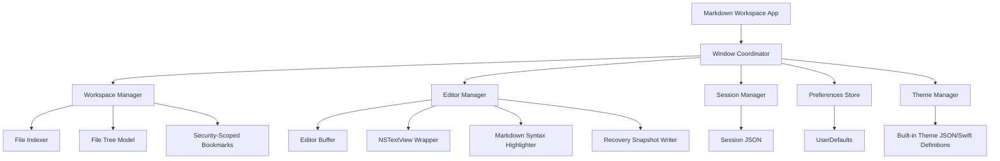
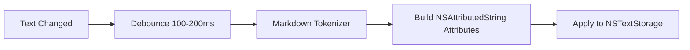

# Plan: Local‑First Markdown Workspace for macOS

## 1. Product Summary

You are building a **local-first, lightweight plain-text workspace for macOS**, focused on Markdown writing, documentation, notes, prompts, and developer-oriented text work.

### v1 Product Positioning

> A fast native macOS Markdown workspace that opens folders, lets you edit files directly, restores your entire session after quit or crash, and gives writers/developers a clean configurable editing environment.

### Primary Users

- Writers
- Developers
- Technical note takers
- Prompt engineers
- Documentation authors

### Primary Platform

- macOS Tahoe only
- Apple Silicon development machine
- Native macOS app, optimized for desktop workflow

---

# 2. Recommended v1 Strategy

## Core Recommendation

Build a **native macOS app using Swift, SwiftUI, and AppKit-backed editor components**.

### Why Native Swift Instead of Electron/Tauri?

| Option | Pros | Cons | Recommendation |
|---|---|---|---|
| Native Swift / SwiftUI / AppKit | Best macOS feel, fastest, best file access, lowest memory, good release path | More Apple-specific knowledge needed | **Best choice for v1** |
| Electron | Fast to prototype, rich web editor ecosystem | Heavy, less native, worse “lightweight” positioning | Avoid for this app |
| Tauri | Lighter than Electron, web UI flexibility | More integration complexity, editor/file APIs still bridge-heavy | Possible but not ideal |
| Catalyst | Can share iPad/macOS, SwiftUI friendly | Not needed for macOS-only app | Avoid |
| AppKit-only | Maximum control | Slower UI development | Use only where necessary |

## Recommended Stack

```text
Language:           Swift 6 or latest stable Swift
UI Layer:           SwiftUI
Editor Layer:       AppKit NSTextView wrapped in SwiftUI
Persistence:        Codable JSON + UserDefaults/AppStorage for v1
File Access:        FileManager + security-scoped bookmarks
Build System:       Xcode + Swift Package Manager
Testing:            XCTest + XCUITest
Release:            Developer ID notarized DMG, possibly Sparkle updates later
```

---

# 3. v1 Feature Scope

## Mandatory v1 Features

| Feature | v1 Implementation Approach |
|---|---|
| Source Mode | Raw Markdown editing in `NSTextView` |
| Markdown/Text File Open/Edit/Save | Direct file read/write with dirty state tracking |
| Open Folders as Workspaces | `NSOpenPanel` folder picker + persisted security-scoped bookmark |
| File Tree Sidebar | Recursive directory tree with filtering |
| Quick File Switching | `Cmd+P` fuzzy finder over indexed files |
| Recent Files | Recent documents menu + in-app recent file list |
| Session Recovery / Hot Exit | Periodic session snapshots with unsaved buffer recovery |
| Themes | Built-in theme definitions |
| Font Controls | Font family, size, weight where relevant |
| Layout Controls | Line height, editor width, alignment, spacing |

## Explicitly Defer Until After v1

These should not block v1:

- Live Markdown preview
- WYSIWYG mode
- Plugin system
- AI integrations
- Pandoc export
- Custom user themes
- Terminal or coding-agent integrations
- Complex Markdown AST-based editor

The first release should be excellent at **editing local Markdown files safely**.

---

# 4. Product Architecture

## High-Level Architecture



---

# 5. Recommended App Model

You have two possible models:

## Option A: Document-Based macOS App

Apple has `NSDocument` and `DocumentGroup`, but this is usually optimized for one document per window.

### Pros

- Built-in document open/save behavior
- macOS-native document lifecycle

### Cons

- Harder to model folder workspaces
- Harder to restore custom tab/session state
- More friction for “workspace as project”

## Option B: Custom Workspace App

The app manages folders, tabs, files, session state, and saves manually.

### Pros

- Better for Obsidian/Zed/VS Code-like workflow
- Easier folder sidebar
- Easier tab/session recovery
- Easier future plugin/AI/preview architecture

### Cons

- You must implement file safety yourself

## Recommendation

Use **Option B: Custom Workspace App**.

---

# 6. Data Model

## Core Models

```swift
struct Workspace: Codable, Identifiable {
    let id: UUID
    var name: String
    var rootURLBookmarkData: Data
    var lastOpenedAt: Date
}

struct WorkspaceFile: Identifiable, Hashable {
    let id: UUID
    let url: URL
    let relativePath: String
    let displayName: String
    let fileExtension: String
    let isDirectory: Bool
}

struct EditorTab: Codable, Identifiable {
    let id: UUID
    var fileBookmarkData: Data?
    var filePath: String?
    var title: String
    var isDirty: Bool
    var cursorLocation: Int
    var selectedLength: Int
    var scrollOffsetY: Double
}

struct EditorBuffer: Identifiable {
    let id: UUID
    var fileURL: URL?
    var text: String
    var savedTextHash: String
    var isDirty: Bool
    var encoding: String.Encoding
    var cursorLocation: Int
    var scrollOffsetY: Double
}

struct AppSession: Codable {
    var workspace: Workspace?
    var tabs: [EditorTab]
    var selectedTabID: UUID?
    var windowFrame: CodableRect?
    var sidebarWidth: Double
    var editorLayout: EditorLayoutSettings
    var savedAt: Date
}

struct EditorLayoutSettings: Codable {
    var fontFamily: String
    var fontSize: Double
    var lineHeightMultiple: Double
    var blockSpacing: Double
    var editorMaxWidth: Double
    var editorAlignment: EditorAlignment
    var showLineNumbers: Bool
}
```

---

# 7. Persistence Strategy

## App Support Directory

Store internal app state here:

```text
~/Library/Application Support/YourAppName/
  Sessions/
    latest-session.json
    recovery/
      buffer-{uuid}.json
  Preferences/
    preferences.json
  Workspaces/
    recent-workspaces.json
  Logs/
    app.log
```

## UserDefaults

Use for simple preferences:

- Selected theme
- Font size
- Sidebar visibility
- Last opened workspace ID
- Telemetry opt-in if ever added

## Codable JSON

Use for:

- Session recovery
- Recent workspaces
- Tab layout
- Recovery buffers

## Do Not Use SwiftData/Core Data for v1

For v1, SwiftData is unnecessary complexity. JSON is easier for AI-assisted development, easier to debug, and adequate for a local Markdown editor.

---

# 8. File Access and macOS Sandbox

If distributing outside the Mac App Store, sandboxing is optional. However, designing with sandbox compatibility is wise.

## Required File Capabilities

- Open files
- Open folders
- Save files
- Persist access to selected folders across launches

## Recommended Entitlements

If sandboxed:

```text
com.apple.security.app-sandbox = true
com.apple.security.files.user-selected.read-write = true
```

Use **security-scoped bookmarks** for workspace folders and recent files.

Apple docs:

- [App Sandbox](https://developer.apple.com/documentation/security/app_sandbox)
- [Security-Scoped Bookmarks](https://developer.apple.com/documentation/foundation/nsurl/bookmark_creation_options)

---

# 9. v1 UI/UX Design

## Main Window Layout

```text
┌──────────────────────────────────────────────────────────────┐
│ Toolbar: Workspace Name        Search/Cmd+P     Theme/Menu   │
├───────────────┬──────────────────────────────────────────────┤
│ File Sidebar  │ Tab Bar                                       │
│               ├──────────────────────────────────────────────┤
│ folder/       │                                              │
│   notes/      │              Markdown Editor                 │
│   docs/       │                                              │
│   README.md   │                                              │
│               │                                              │
└───────────────┴──────────────────────────────────────────────┘
```

## v1 UI Principles

- Native macOS conventions
- Minimal chrome
- Fast keyboard workflow
- No surprise formatting
- Raw Markdown always visible
- Avoid destructive autosave behavior unless explicitly designed

## Recommended Screens

### 1. Welcome / Empty State

When no workspace is open:

```text
Open a Folder
Open a File
Recent Workspaces
Recent Files
```

### 2. Workspace View

- Sidebar file tree
- Open file tabs
- Editor
- Optional status bar

### 3. Quick Switcher

Triggered by:

```text
Cmd+P
```

Capabilities:

- Fuzzy search files in workspace
- Keyboard navigation
- Open selected file
- Show relative path

### 4. Settings Window

Settings categories:

```text
General
Editor
Appearance
Files
Keyboard Shortcuts
```

For v1, keyboard shortcuts can be fixed, even if the settings screen has a placeholder for future customization.

---

# 10. Keyboard Shortcuts

## Recommended v1 Shortcuts

| Shortcut | Action |
|---|---|
| `Cmd+O` | Open file |
| `Cmd+Shift+O` | Open folder/workspace |
| `Cmd+S` | Save current file |
| `Cmd+Shift+S` | Save As |
| `Cmd+P` | Quick file switcher |
| `Cmd+W` | Close tab/window behavior |
| `Cmd+T` | New untitled tab |
| `Cmd+,` | Settings |
| `Cmd+1` | Toggle sidebar |
| `Cmd+Plus` | Increase font size |
| `Cmd+Minus` | Decrease font size |
| `Cmd+0` | Reset font size |
| `Cmd+[` | Previous tab |
| `Cmd+]` | Next tab |

---

# 11. Editor Implementation

## Do Not Use SwiftUI `TextEditor` for v1

`TextEditor` is too limited for:

- Syntax highlighting
- Precise cursor recovery
- Scroll position recovery
- Advanced typography
- File-size handling
- Future line numbers/minimap/features

## Use AppKit `NSTextView`

Wrap `NSTextView` in SwiftUI:

```swift
struct MarkdownEditorView: NSViewRepresentable {
    @Binding var text: String
    var theme: EditorTheme
    var layout: EditorLayoutSettings

    func makeNSView(context: Context) -> NSScrollView {
        // Create NSTextView inside NSScrollView
    }

    func updateNSView(_ nsView: NSScrollView, context: Context) {
        // Update text, theme, font, layout
    }
}
```

## Editor Component Responsibilities

```text
MarkdownEditorView
  - render/edit raw text
  - apply font/theme/layout
  - report text changes
  - report cursor position
  - report scroll position
  - support find later
  - support syntax highlighting
```

---

# 12. Markdown Syntax Highlighting

## v1 Recommended Approach

Use a custom lightweight highlighter for Markdown syntax.

Highlight:

- Headings
- Bold
- Italic
- Code spans
- Fenced code blocks
- Links
- Blockquotes
- Lists
- Horizontal rules
- YAML frontmatter

### Why Not Full Markdown AST Highlighting for v1?

Full parsing is more complex and can slow down implementation. A regex/token scanner is enough for first release.

## Syntax Highlighting Pipeline



## Performance Guardrails

- Debounce highlighting
- Highlight only visible range when possible
- Disable expensive highlighting for files over a threshold, e.g. 2 MB
- Preserve cursor/selection during attribute updates
- Never mutate actual string during highlighting

---

# 13. File Tree Sidebar

## Supported v1 File Types

Primary:

```text
.md
.markdown
.mdown
.txt
```

Optional visible but read-only/code viewer later:

```text
.json
.yaml
.yml
.toml
.swift
.js
.ts
.py
```

For v1, you can still open any plain text file, but optimize UX around Markdown/text.

## Excluded Directories

Default ignore list:

```text
.git
node_modules
.DS_Store
.build
DerivedData
dist
out
target
venv
.env
```

## File Tree Requirements

- Expand/collapse folders
- Click file to open
- Refresh on external changes
- Basic sorting:
  - folders first
  - alphabetical
- Optional context menu:
  - Reveal in Finder
  - Copy path
  - Rename later
  - Delete later

## v1 Simplification

Do not implement complex create/rename/delete in the first milestone unless time permits. Opening, editing, and saving existing files matters more.

---

# 14. Quick File Switching

## Implementation

Build an in-memory index of workspace files:

```swift
struct FileSearchIndex {
    var files: [WorkspaceFile]

    func search(_ query: String) -> [WorkspaceFile] {
        // fuzzy match on filename and relative path
    }
}
```

## Fuzzy Search Algorithm v1

A simple scoring algorithm is enough:

- Exact filename match: high score
- Prefix match: high score
- Consecutive character match: medium score
- Character subsequence match: low score
- Recently opened files get boost

Example:

```text
query: "read"
matches:
  README.md
  docs/reading-list.md
  notes/research/deep-reading.md
```

---

# 15. Recent Files and Workspaces

## Use Two Recent Lists

```text
Recent Files
Recent Workspaces
```

Store:

```swift
struct RecentItem: Codable, Identifiable {
    let id: UUID
    var displayName: String
    var bookmarkData: Data
    var pathHint: String
    var lastOpenedAt: Date
}
```

## macOS Integration

Also call:

```swift
NSDocumentController.shared.noteNewRecentDocumentURL(url)
```

This helps integrate with system Recent Items.

---

# 16. Session Recovery / Hot Exit

This is one of the most important v1 features.

## What Must Be Restored

- Open workspace
- Open tabs
- Selected tab
- Unsaved changes
- Cursor positions
- Scroll positions
- Sidebar width
- Window frame/state
- Theme/layout settings

## Recovery Strategy

### On Every Important Event

Write a session snapshot:

- App launch
- Workspace open
- Tab open/close
- Selected tab changes
- Text changed after debounce
- Cursor changed
- Window resized
- App becomes inactive
- App terminates

### Use Two Layers

#### 1. Session Metadata

```text
latest-session.json
```

Stores:

- workspace bookmark
- open tabs
- selected tab
- window state
- cursor positions

#### 2. Recovery Buffers

```text
recovery/buffer-{tabID}.json
```

Stores:

- file bookmark/path
- unsaved text
- last saved hash
- timestamp

## Important Data Loss Rule

Never overwrite the original file automatically unless the user saves or you intentionally implement autosave.

For v1, I recommend:

```text
Hot Exit saves recovery copies, not original files.
Cmd+S saves original files.
```

This is safer and easier to explain.

## Crash Recovery Flow

On launch:

1. Load `latest-session.json`
2. Resolve workspace bookmark
3. Reopen tabs
4. Load file contents from disk
5. If recovery buffer exists and differs from disk:
   - restore unsaved text automatically
   - mark tab as dirty
   - optionally show “Recovered unsaved changes”

---

# 17. Themes

## Built-In v1 Themes

Provide at least:

```text
System
Light
Dark
Solarized Light
Solarized Dark
Mono Dark
Paper
```

## Theme Model

```swift
struct EditorTheme: Codable, Identifiable {
    let id: String
    let name: String
    let background: ColorValue
    let foreground: ColorValue
    let selection: ColorValue
    let cursor: ColorValue
    let heading: ColorValue
    let link: ColorValue
    let code: ColorValue
    let quote: ColorValue
    let comment: ColorValue
    let sidebarBackground: ColorValue
}
```

Use custom `ColorValue` instead of directly storing SwiftUI `Color`.

---

# 18. Font and Layout Controls

## v1 Settings

```text
Font family
Font size
Line height
Paragraph/block spacing
Editor max width
Editor alignment
Sidebar visibility
Tab bar visibility
```

## Recommended Defaults

```text
Font family: SF Mono or New York/SF Pro depending on theme
Font size: 15 or 16
Line height: 1.45
Editor max width: 760-860 px
Alignment: centered
Sidebar width: 240 px
```

---

# 19. Project Structure

Recommended repo structure:

```text
MarkdownWorkspace/
  MarkdownWorkspace.xcodeproj
  MarkdownWorkspace/
    App/
      MarkdownWorkspaceApp.swift
      AppDelegate.swift
      Commands.swift

    Core/
      Models/
        Workspace.swift
        WorkspaceFile.swift
        EditorBuffer.swift
        AppSession.swift
        RecentItem.swift
      Services/
        WorkspaceManager.swift
        FileService.swift
        FileIndexer.swift
        SessionManager.swift
        RecoveryStore.swift
        PreferencesStore.swift
        ThemeManager.swift
        RecentItemsStore.swift
        SecurityScopedBookmarkStore.swift
      Utilities/
        FuzzySearch.swift
        FileEncodingDetector.swift
        AtomicWriter.swift
        Logger.swift

    Features/
      Welcome/
        WelcomeView.swift
      Workspace/
        WorkspaceView.swift
        FileTreeView.swift
        SidebarView.swift
      Editor/
        MarkdownEditorView.swift
        MarkdownTextView.swift
        MarkdownSyntaxHighlighter.swift
        EditorTabBar.swift
        EditorStatusBar.swift
      QuickSwitcher/
        QuickSwitcherView.swift
        QuickSwitcherViewModel.swift
      Settings/
        SettingsView.swift
        EditorSettingsView.swift
        AppearanceSettingsView.swift

    Resources/
      Themes/
        BuiltInThemes.swift
      Assets.xcassets

  MarkdownWorkspaceTests/
    FileServiceTests.swift
    SessionManagerTests.swift
    FuzzySearchTests.swift
    MarkdownSyntaxHighlighterTests.swift

  MarkdownWorkspaceUITests/
    WorkspaceOpenUITests.swift
    EditorSaveUITests.swift
    SessionRecoveryUITests.swift

  docs/
    PRODUCT_SPEC.md
    ARCHITECTURE.md
    ROADMAP.md
    TEST_PLAN.md
    RELEASE_CHECKLIST.md
```

---

# 20. Development Roadmap

## Stage 0: Product Definition and Repo Setup

### Goal

Create a clean foundation so AI agents can build reliably.

### Tasks

- Create Git repo
- Create Xcode project
- Add README
- Add product spec
- Add architecture doc
- Add issue tracker labels
- Add SwiftLint/SwiftFormat if desired
- Add initial CI workflow if using GitHub

### Deliverables

```text
README.md
docs/PRODUCT_SPEC.md
docs/ARCHITECTURE.md
docs/ROADMAP.md
docs/TEST_PLAN.md
```

### AI Prompt

```text
You are helping build a native macOS Markdown workspace app in SwiftUI/AppKit.
Create a concise PRODUCT_SPEC.md for v1 based on these mandatory features:
raw Markdown editing, open folders as workspaces, file tree sidebar,
quick file switching, recent files, hot exit/session recovery, themes,
font controls, and layout controls.

Do not include WYSIWYG, plugins, AI, or preview in v1.
Output only the markdown document.
```

---

## Stage 1: Native App Shell

### Goal

Launch a native macOS app with basic window structure.

### Tasks

- Create SwiftUI app
- Add app commands
- Add Welcome screen
- Add basic workspace screen placeholder
- Add settings window placeholder
- Add menu commands:
  - Open File
  - Open Folder
  - Save
  - Quick Open
  - Preferences

### Acceptance Criteria

- App launches
- Main window appears
- Menus are wired
- Empty state has open file/folder buttons
- Settings opens

---

## Stage 2: File Open/Edit/Save

### Goal

Open a Markdown/text file, edit it, and save it.

### Tasks

- Implement `FileService`
- Add file picker
- Load file contents
- Display text in editor
- Track dirty state
- Save with `Cmd+S`
- Save atomically
- Handle encoding basics

### Acceptance Criteria

- `.md` and `.txt` files open
- Text can be edited
- Dirty indicator appears
- `Cmd+S` writes changes
- Closing dirty tab prompts or keeps recovery snapshot

---

## Stage 3: AppKit Editor

### Goal

Replace any simple prototype editor with robust `NSTextView`.

### Tasks

- Build `MarkdownEditorView: NSViewRepresentable`
- Build `MarkdownTextView`
- Bind text to editor buffer
- Track cursor location
- Track selection
- Track scroll offset
- Apply fonts and colors

### Acceptance Criteria

- Editor feels native
- Cursor position is tracked
- Text changes update buffer
- Large text does not freeze under normal use
- Font settings update editor live

---

## Stage 4: Markdown Syntax Highlighting

### Goal

Add source-mode Markdown highlighting.

### Tasks

- Implement tokenizer/highlighter
- Add theme attributes
- Highlight headings, links, code, lists, quotes
- Debounce updates
- Preserve cursor selection
- Add file-size guardrail

### Acceptance Criteria

- Markdown is visually highlighted
- Editing remains smooth
- Cursor does not jump
- Theme changes re-highlight document

---

## Stage 5: Workspaces and File Tree

### Goal

Open a folder and navigate files.

### Tasks

- Implement folder picker
- Persist security-scoped bookmark
- Build recursive file tree
- Add sidebar view
- Ignore unwanted folders
- Open selected files into tabs
- Watch/refresh file tree manually or with file events

### Acceptance Criteria

- Folder opens as workspace
- Sidebar shows tree
- Markdown/text files open from sidebar
- Workspace reopens after app restart
- Ignored folders are hidden

---

## Stage 6: Tabs and Multi-File Editing

### Goal

Edit multiple files in one workspace.

### Tasks

- Implement `EditorTab`
- Implement tab bar
- Open files in existing/new tabs
- Switch tabs
- Close tabs
- Track per-tab buffer state
- Prevent duplicate tabs for same file

### Acceptance Criteria

- Multiple files can be open
- Switching preserves unsaved changes
- Closing dirty tab does not lose data silently
- Selected tab is restored

---

## Stage 7: Quick File Switcher

### Goal

Implement `Cmd+P`.

### Tasks

- Create file index
- Implement fuzzy search
- Build quick switcher modal
- Keyboard navigation
- Open selected file
- Boost recent files

### Acceptance Criteria

- `Cmd+P` opens quick switcher
- Typing filters files
- Arrow keys move selection
- Enter opens file
- Escape closes switcher

---

## Stage 8: Recent Files and Recent Workspaces

### Goal

Resume work quickly.

### Tasks

- Implement recent files store
- Implement recent workspaces store
- Add recent items to welcome screen
- Add recent menu integration
- Resolve bookmarks safely

### Acceptance Criteria

- Recently opened files appear after restart
- Recently opened workspaces appear after restart
- Broken/missing files are handled gracefully

---

## Stage 9: Session Recovery / Hot Exit

### Goal

Restore everything after quit or crash.

### Tasks

- Implement `SessionManager`
- Implement `RecoveryStore`
- Snapshot on editor changes
- Snapshot cursor/scroll
- Snapshot window state
- Restore tabs
- Restore unsaved buffers
- Mark recovered buffers dirty

### Acceptance Criteria

- Quit app with unsaved edits
- Reopen app
- Unsaved edits return
- Cursor position returns
- Tabs return
- Workspace returns
- Layout returns

This stage deserves extra testing.

---

## Stage 10: Themes, Font Controls, Layout Controls

### Goal

Make the writing environment customizable.

### Tasks

- Implement built-in themes
- Add theme picker
- Add font picker or font family dropdown
- Add font size controls
- Add line height control
- Add editor width control
- Add alignment control
- Persist settings

### Acceptance Criteria

- Themes switch instantly
- Font settings persist
- Layout settings persist
- Editor width/alignment update live

---

## Stage 11: Polish and macOS Quality

### Goal

Make app feel shippable.

### Tasks

- Add app icon
- Add onboarding empty state
- Add status bar info:
  - Line/column
  - Word count
  - Dirty state
- Add error alerts
- Add keyboard shortcut hints
- Add accessibility labels
- Add Help menu
- Add crash-safe write behavior
- Add external file change handling

### Acceptance Criteria

- No obvious rough edges
- Errors are understandable
- App does not lose data
- App looks credible as a macOS product

---

## Stage 12: Release Preparation

### Goal

Ship v1.

### Tasks

- Set bundle identifier
- Configure signing
- Archive app
- Notarize app
- Create DMG
- Build landing/download page if needed
- Create changelog
- Create release notes

Useful Apple docs:

- [Distributing apps outside the Mac App Store](https://developer.apple.com/documentation/xcode/distributing-your-app-for-beta-testing-and-releases)
- [Notarizing macOS software](https://developer.apple.com/documentation/security/notarizing_macos_software_before_distribution)

---

# 21. Testing Plan

## Unit Tests

### FileService Tests

- Open UTF-8 file
- Save file atomically
- Handle missing file
- Handle read-only file
- Preserve line endings if possible

### SessionManager Tests

- Encode/decode session
- Restore selected tab
- Restore cursor locations
- Restore dirty buffer metadata

### RecoveryStore Tests

- Save recovery buffer
- Load recovery buffer
- Delete recovery buffer after successful save
- Detect mismatch between disk and recovery state

### FuzzySearch Tests

- Exact match
- Prefix match
- Subsequence match
- Recent-file boost
- No results

### SyntaxHighlighter Tests

- Heading tokens
- Link tokens
- Code block tokens
- Inline code tokens
- Bold/italic tokens
- Frontmatter tokens

---

## UI Tests

### Critical UI Test Cases

| Test | Expected Result |
|---|---|
| Open folder | File tree appears |
| Open file from sidebar | File appears in editor |
| Edit and save | File content persists |
| Quick switch file | Correct file opens |
| Quit with unsaved edit | Edit restored on relaunch |
| Change theme | Theme persists after restart |
| Change font size | Font size persists |

---

## Manual QA Checklist

### Data Loss Testing

- Edit file, quit without saving, relaunch
- Edit file, force quit, relaunch
- Edit two files, save one, quit, relaunch
- Delete file externally while open
- Modify file externally while open
- Rename workspace folder externally
- Open huge file
- Open binary file accidentally
- Open file with unusual encoding

### macOS Behavior

- Dark mode
- Light mode
- Full screen
- Multiple monitors
- Window restore
- Keyboard shortcuts
- App restart
- Reboot and restore

---

# 22. Agentic Development Workflow

Since you are a solo developer using AI coding agents, structure the project so the AI can work in small, verifiable chunks.

## Recommended Workflow

```text
1. Create/refresh docs
2. Create Git branch
3. Ask AI to implement one narrow task
4. Build locally
5. Run tests
6. Review diff manually
7. Commit
8. Repeat
```

## Do Not Ask AI To Build the Whole App at Once

Bad prompt:

```text
Build the entire Markdown workspace app.
```

Good prompt:

```text
Implement a FileService in Swift that can load and save UTF-8 text files atomically.
Add unit tests for loading, saving, missing file, and read-only file behavior.
Do not modify UI files.
```

---

# 23. Suggested Git Workflow

## Branches

```text
main
develop
feature/editor-textview
feature/file-tree
feature/session-recovery
feature/quick-switcher
feature/themes
```

For a solo project, you can also use:

```text
main
feature/*
```

## Commit Style

Use conventional commits:

```text
feat: add file open and save service
feat: implement workspace file tree
fix: preserve cursor during syntax highlighting
test: add session recovery tests
docs: update architecture overview
```

## Definition of Done

A task is done only when:

- Code builds
- Feature works manually
- Relevant tests pass
- No obvious data-loss risk
- Docs updated if architecture changed
- Changes committed to Git

---

# 24. AI Agent Roles

You can use different LLM sessions as specialized roles.

## Architect Agent

Purpose:

- Refine architecture
- Review tradeoffs
- Prevent overengineering

Prompt:

```text
You are the architecture reviewer for a native macOS Markdown workspace app.
Review the proposed implementation for simplicity, data safety, testability,
and alignment with v1 scope. Identify risks and suggest concrete improvements.
Do not propose features outside v1 unless they reduce risk.
```

## Implementer Agent

Purpose:

- Write specific code

Prompt:

```text
You are implementing one feature in a SwiftUI/AppKit macOS app.
Follow the existing architecture and avoid broad rewrites.
Implement only the requested task.
Add or update tests where appropriate.
Explain files changed at the end.
```

## Reviewer Agent

Purpose:

- Review AI-generated code

Prompt:

```text
Review this Swift code for correctness, macOS best practices, data-loss risks,
threading issues, retain cycles, and testability.
Focus especially on file I/O, session recovery, and NSTextView behavior.
Return a prioritized list of issues.
```

## Tester Agent

Purpose:

- Generate test cases

Prompt:

```text
Generate XCTest and manual QA test cases for this feature.
Focus on edge cases, data loss, persistence, and macOS file access behavior.
```

---

# 25. Implementation Order for Maximum Momentum

If you want the fastest path to a usable app, build in this exact order:

```text
1. App shell
2. Open single file
3. NSTextView editor
4. Save file
5. Dirty state
6. Open folder
7. File tree
8. Tabs
9. Quick switcher
10. Recent files/workspaces
11. Session recovery
12. Syntax highlighting
13. Themes
14. Font/layout settings
15. Polish/release
```

Session recovery is mandatory, but implementing it after tabs is easier.

---

# 26. Risk Register

## High-Risk Areas

| Risk | Severity | Mitigation |
|---|---:|---|
| Data loss from bad save/recovery logic | Very High | Atomic writes, recovery snapshots, heavy tests |
| Cursor jumps during syntax highlighting | High | Preserve selected ranges, avoid replacing whole string |
| Sandbox file access breaks after restart | High | Use security-scoped bookmarks |
| Large files freeze editor | Medium | Size thresholds, debounced highlighting |
| Scope creep into WYSIWYG/AI/plugins | High | Lock v1 scope |
| SwiftUI/AppKit integration bugs | Medium | Isolate editor wrapper, test manually |
| External file changes | Medium | Detect modification date/hash before save |

---

# 27. Save and File Safety Rules

This app must feel trustworthy. Follow these rules:

## Golden Rules

1. Never silently discard unsaved edits.
2. Never overwrite disk unless user saves or has explicitly enabled autosave.
3. Always keep recovery snapshots for dirty buffers.
4. Use atomic writes.
5. Before saving, check whether the file changed on disk.
6. If a conflict exists, show a clear choice.

## External Modification Flow

If file changed on disk while open:

```text
This file was modified outside the app.

Options:
- Reload from Disk
- Keep My Version
- Save As...
- Compare Later
```

For v1, you can implement a simpler alert:

```text
File changed on disk. Saving may overwrite external changes.
Cancel / Overwrite
```

---

# 28. Minimum v1 Acceptance Criteria

Your app is v1-ready when this full scenario works:

```text
1. Launch app.
2. Open a folder containing Markdown files.
3. Sidebar displays files.
4. Open README.md.
5. Edit raw Markdown with syntax highlighting.
6. Open another Markdown file.
7. Use Cmd+P to jump back to README.md.
8. Change theme and font size.
9. Quit app without saving one edited file.
10. Relaunch app.
11. Workspace, tabs, cursor positions, layout, and unsaved changes restore.
12. Save the file.
13. Quit and relaunch again.
14. Saved file remains correct.
```

If this works reliably, you have a credible v1.

---

# 29. Suggested v1 Milestones

## Milestone 1: Editable File

```text
Duration: 2-4 days
Outcome: Open, edit, save one Markdown file.
```

## Milestone 2: Workspace

```text
Duration: 3-6 days
Outcome: Open folder, file tree, open files from sidebar.
```

## Milestone 3: Productive Editing

```text
Duration: 4-8 days
Outcome: Tabs, quick switcher, recent files.
```

## Milestone 4: Trustworthy Recovery

```text
Duration: 4-8 days
Outcome: Full hot exit/session recovery.
```

## Milestone 5: Appearance

```text
Duration: 3-5 days
Outcome: Themes, fonts, layout controls.
```

## Milestone 6: Release Polish

```text
Duration: 5-10 days
Outcome: Stable, tested, signed, notarized app.
```

---

# 30. Post-v1 Roadmap

Once v1 is stable, the most natural next features are:

## v1.1

- Live Markdown preview
- Word count and reading time
- Find/replace
- Better external file change detection
- More keyboard shortcuts

## v1.2

- Custom themes
- Export to HTML/PDF
- Pandoc integration
- TextBundle support

## v2

- WYSIWYG/live Markdown editing
- Plugin system
- AI command palette
- MCP integrations
- Terminal/coding-agent integrations
- Workspace search
- Backlinks/wiki links

---

# 31. Final Recommendation

Build this as a **focused native macOS editor first**, not as an all-in-one productivity platform.

For v1, the competitive advantage should be:

```text
Fast.
Local.
Plain text.
Beautiful enough.
Reliable session recovery.
No data loss.
Excellent keyboard workflow.
```

If you keep the scope disciplined and use AI agents on small isolated tasks, this is very achievable as a solo developer.
