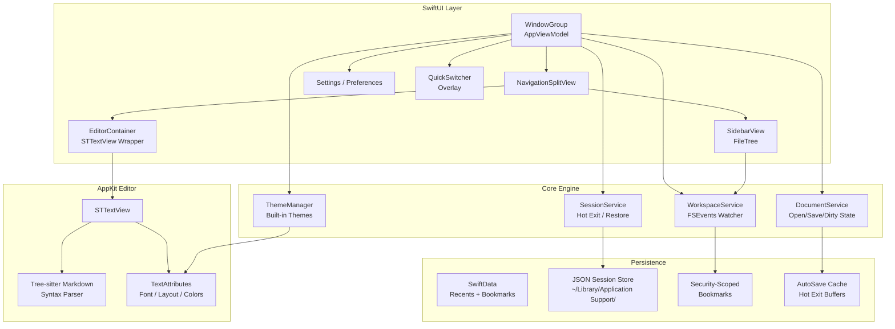
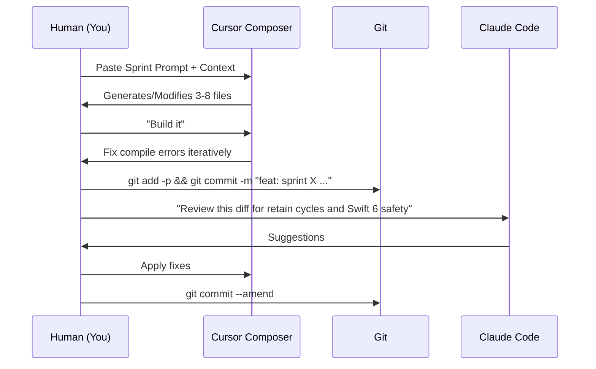

# 🛠️ MacOS Native Markdown Workspace: Master Blueprint for Agentic Development

> **Project Codename:** *QuillSmith* (suggested)  
> **Philosophy:** Local-first, zero-latency, chromeless productivity.  
> **Methodology:** Vibe-Coding Architecture — Human defines the edge, AI generates the graph.

---

## 1. Executive Strategy: The "Why" Behind the Stack

You are building a **macOS-native, lightweight, plain-text powerhouse**. Because your target is exclusively macOS (Tahoe/15.0+) and your users are writers and developers who *feel* latency, the correct choice is **Native Swift + SwiftUI with an AppKit editor core**.

| Criterion | SwiftUI/AppKit (Chosen) | Tauri/Electron (Rejected) |
|-----------|------------------------|---------------------------|
| **Memory / Weight** | ~15-40MB base | Tauri: ~80MB; Electron: 200MB+ |
| **Hot Exit / Session** | Native `AppDelegate` APIs | Custom hacks, flaky restore |
| **Text Rendering** | Core Text, 120Hz ProMotion | WebKit compositor, jitter |
| **File System** | Security-scoped bookmarks, FSEvents | Rust/JS bridge latency |
| **AI Vibe-Coding** | Excellent (Swift 6 + SwiftData are well-represented in training data) | Excellent (React), but Rust backend adds impedance |
| **Distribution** | Native `.app` signing & notarization | Extra abstraction layer |

### The Golden Stack
- **Language:** Swift 6 (Strict Concurrency Enabled)
- **UI Framework:** SwiftUI with `NavigationSplitView` + AppKit bridging
- **Editor Core:** [`STTextView`](https://github.com/krzyzanowskim/STTextView) (Modern `NSTextView` rewrite for SwiftUI) + `swift-tree-sitter`
- **Syntax Highlighting:** `tree-sitter-markdown`
- **State & Metadata:** SwiftData (for recents, bookmarks, themes) + JSON (for session recovery)
- **Filesystem:** `FileManager` + `FSEvents` (via `EonilFSEvents` or raw CoreServices)
- **Build Tool:** Xcode 16+
- **Target:** macOS 15.0+ (Apple Silicon optimized)

---

## 2. System Architecture



---

## 3. Project Directory Structure (AI-Optimized)

Organize the Xcode project so an AI agent can reason about boundaries. Use **Feature-based folders**, not role-based.

```
QuillSmith/
├── App/
│   ├── QuillSmithApp.swift          // @main, AppDelegate adaptor
│   └── Info.plist
├── Core/                            // Shared infrastructure
│   ├── Extensions/
│   ├── Utilities/
│   ├── Errors/
│   └── Protocols/
├── Domain/                          // Pure models, no UI
│   ├── Document.swift
│   ├── Workspace.swift
│   ├── FileNode.swift
│   ├── AppSession.swift
│   └── Theme.swift
├── Persistence/                     // SwiftData + JSON
│   ├── SwiftData/
│   │   └── Schema/
│   ├── SessionStore.swift
│   └── BookmarkManager.swift
├── Services/                        // Business logic
│   ├── WorkspaceService.swift
│   ├── DocumentService.swift
│   ├── FileSystemEventService.swift
│   └── RecentFilesService.swift
├── Editor/                          // The sacred text box
│   ├── STTextViewBridge.swift       // NSViewRepresentable
│   ├── SyntaxHighlighter.swift      // Tree-sitter integration
│   ├── EditorViewModel.swift
│   └── LayoutEngine.swift
├── Features/
│   ├── Sidebar/
│   │   ├── SidebarView.swift
│   │   ├── FileTreeView.swift
│   │   └── FileNodeViewModel.swift
│   ├── QuickSwitcher/
│   │   ├── QuickSwitcherView.swift
│   │   └── FuzzySearch.swift
│   ├── Settings/
│   │   ├── SettingsView.swift
│   │   ├── ThemePicker.swift
│   │   └── FontLayoutSettings.swift
│   └── Toolbar/
│       └── MainToolbar.swift
├── Resources/
│   ├── Themes/                      // JSON theme definitions
│   └── Assets.xcassets/
└── QuillSmithTests/
```

---

## 4. The Vibe-Coding Sprint Plan

Below is the **8-Sprint sequence**. Each sprint is designed to be fed into an AI agent (Cursor Composer, Windsurf Cascade, or Claude Code) as a self-contained prompt packet.

---

### 🧱 Sprint 0: Bootstrap & The Foundation
**Goal:** A compiling macOS app with the correct entitlements, dependencies, and navigation shell.

**Your Prompt to AI:**
```markdown
You are a senior macOS engineer. Create a new Xcode 16 project for a macOS 15+ app named "QuillSmith".

Requirements:
1. Swift 6 language mode with strict concurrency checking enabled.
2. Use Swift Package Manager to add:
   - `STTextView` (krzyzanowskim/STTextView)
   - `swift-tree-sitter` (ChimeHQ/swift-tree-sitter)
   - `TreeSitterMarkdown` (tree-sitter-grammars/tree-sitter-markdown via swift package if available, else vendor the parser)
3. Set up the directory structure: App, Core, Domain, Persistence, Services, Editor, Features.
4. Configure entitlements: `com.apple.security.files.user-selected.read-write` = true. Enable App Sandbox but with user-selected file access. Add `com.apple.security.temporary-exception.files.home-relative-path.read-write` is NOT allowed; we will use security-scoped bookmarks.
5. Create the main window: A `NavigationSplitView` with a sidebar placeholder and a detail placeholder. The sidebar should be 220pt wide.
6. Add a native Toolbar with items: "Open Folder", "New File", "Save", and a search field.
7. Implement a basic `AppDelegate` adapter (using `NSApplicationDelegateAdaptor`) to intercept application lifecycle events for later session restoration.

Do NOT implement editor logic yet. Ensure it compiles and runs.
```

**Success Criteria:**
- [ ] App launches to a 3-pane looking window.
- [ ] Menu bar has native File > Open Folder.
- [ ] No build warnings in Swift 6.

---

### 📁 Sprint 1: Workspace & File System Engine
**Goal:** Open a folder, persist access across launches, render a file tree.

**Your Prompt to AI:**
```markdown
Implement the Workspace and File Tree engine for QuillSmith.

1. **Domain Models:**
   - `Workspace`: id(UUID), name(String), bookmark(Data?), rootURL(URL?), openedAt(Date).
   - `FileNode`: id(UUID), url(URL), name(String), isFolder(Bool), children([FileNode]), parent(UUID?).

2. **BookmarkManager (Actor):**
   - `requestAccess(to url: URL) -> Data` creates a security-scoped bookmark.
   - `resolveBookmark(_ data: Data) -> URL` resolves and starts accessing.
   - `stopAccessing(url: URL)`.

3. **WorkspaceService (Observable @MainActor class):**
   - `openFolder()` presents `NSOpenPanel` (canChooseDirectories=true, canChooseFiles=false).
   - On selection, create bookmark, store in SwiftData, set as `activeWorkspace`.
   - `loadWorkspace(from bookmark: Data)` resolves and scans the directory.
   - Scanning: Recursive `FileManager` enumeration, skipping hidden files (`.git`, `.DS_Store`, `node_modules`).
   - Expose `@Published var fileTree: [FileNode]` and `@Published var activeWorkspace: Workspace?`.

4. **SidebarView:**
   - Use `OutlineGroup` or recursive `View` to display `FileNode`.
   - Folders are collapsible.
   - Clicking a file emits an event (via NotificationCenter or closure) to open it.
   - Show file icons using `NSWorkspace.shared.icon(forFile:)`.

5. **Recents:**
   - Add "Open Recent" submenu to File menu using `NSDocumentController`-style or a custom `RecentFilesService` backed by SwiftData.
   - Store last 10 workspaces.

Ensure bookmarks are started/stopped correctly to avoid sandbox violations.
```

**Success Criteria:**
- [ ] `Cmd+Shift+O` opens folder dialog.
- [ ] Selecting a folder populates the sidebar with its file tree.
- [ ] Quit and relaunch: recent workspaces appear in File > Open Recent.
- [ ] Hidden files are excluded.

---

### ✍️ Sprint 2: The Editor Core & Syntax Highlighting
**Goal:** A performant text editor that can open `.md` and `.txt` with Markdown syntax highlighting.

**Your Prompt to AI:**
```markdown
Implement the Editor module using STTextView and Tree-sitter.

1. **EditorViewModel (Observable):**
   - `document: Document` model (url, content, isDirty, fileExtension).
   - `load(from url: URL)` reads file content (UTF-8, fallback to UTF-16 if needed).
   - `save()` writes content back to `url` if not nil; update `isDirty = false`.
   - `saveAs()` presents `NSSavePanel`.

2. **STTextViewBridge:**
   - Create `EditorSwiftUIView: NSViewRepresentable`.
   - Wrap `STTextView` (or a custom `STTextViewController`).
   - Bind `String` content two-way: typing updates ViewModel, ViewModel updates text view only if external change occurs (avoid loops).
   - Support "Dirty" state: track `NSTextStorage` edits via delegate or notification to set `isDirty = true`.

3. **Syntax Highlighting:**
   - Initialize `swift-tree-sitter` with the Markdown parser.
   - On text change (debounced by 0.3s), parse the content.
   - Apply attributes to `STTextView`'s `textStorage`:
     - Headings (#): Bold, larger font, theme heading color.
     - Code blocks (`): Monospace font, subtle background.
     - Links: Underlined, accent color.
     - Bold/Italic: respective traits.
     - Comments/HTML tags: subtle color.

4. **Tab Model (Conceptual):**
   - Create a `TabDocument` struct representing an open editor tab.
   - The main view should support multiple tabs (use `TabView` with custom styling, or a horizontal scroll of tab buttons above the editor).

5. **Plain Text Fallback:**
   - If file is `.txt` or unknown, disable markdown-specific highlighting but keep basic editor functionality.

Make sure the editor feels instant on a 10,000-line markdown file.
```

**Success Criteria:**
- [ ] Double-clicking a `.md` file in sidebar opens it in the editor.
- [ ] Typing `# Hello` shows styled heading.
- [ ] `Cmd+S` saves the file.
- [ ] Closing a dirty tab/window shows a "Save Changes?" alert (use `NSAlert` via AppKit bridge if needed).

---

### 🧠 Sprint 3: Session Recovery & Hot Exit
**Goal:** The app is crash-proof. Users never lose work.

**Your Prompt to AI:**
```markdown
Implement Session Recovery and Hot Exit for QuillSmith.

1. **Models:**
   - `AppSession`: workspaceBookmarks [Data], windowFrame(String), sidebarWidth(CGFloat), selectedFileURLs [String].
   - `EditorSession`: fileURL(String), cursorPosition(Int), scrollOffset(CGPoint), unsavedContent(String?), isDirty(Bool), modifiedAt(Date).

2. **SessionService:**
   - On `applicationShouldTerminate`, capture state:
     - Serialize all open `TabDocument`s into `[EditorSession]`.
     - If dirty, save `unsavedContent` to `~/Library/Application Support/QuillSmith/Autosave/<UUID>.tmp`.
     - Save `AppSession` to `session.json`.
     - Return `.terminateLater` and call `NSApp.reply(toApplicationShouldTerminate: true)` after async save completes (use a short timeout, max 2s).
   - On `applicationDidFinishLaunching`:
     - Read `session.json`.
     - Restore workspace bookmarks via BookmarkManager.
     - Re-open files. If tmp file exists and is newer than original, prompt user to restore unsaved changes OR silently restore (Hot Exit style).
     - Restore cursor position and scroll offset.

3. **AutoSave:**
   - Every 5 seconds of typing, if dirty, write a backup tmp file.
   - Clean up tmp files on successful manual save.

4. **Crash Recovery:**
   - If app crashed (detect via a `didCloseCleanly` flag in UserDefaults), on next launch show a recovery sheet listing unsaved documents.

5. **Window State:**
   - Save/restore window frame using `NSWindow` frame autosave name OR manual frame serialization.

The user should be able to `Cmd+Q`, relaunch, and see everything exactly as they left it, even if they hadn't saved.
```

**Success Criteria:**
- [ ] Type in a new untitled document, `Cmd+Q`, relaunch: text is restored.
- [ ] Open file, scroll down, place cursor, quit: position restored.
- [ ] Sidebar width and window size persist.

---

### 🎨 Sprint 4: Themes, Font & Layout Controls
**Goal:** The app feels like a native writing environment, customizable and beautiful.

**Your Prompt to AI:**
```markdown
Build the Theme Engine and Layout Controls.

1. **Theme Model (JSON-decodable):**
   - `Theme`: name, identifier, isDark.
   - Colors: editorBackground, editorForeground, caret, selection, sidebarBackground, lineHighlight.
   - Syntax: heading, bold, italic, codeBlock, link, comment, quote.
   - Ship with 4 built-in themes in `/Resources/Themes/`: `Default Light`, `Midnight`, `Sepia`, `High Contrast`.
   - Load themes at launch into `ThemeManager` (@Observable).

2. **Applying Themes:**
   - `ThemeManager` publishes `activeTheme`.
   - Sidebar background and editor background update immediately.
   - STTextView wrapper observes theme and updates `backgroundColor`, `insertionPointColor`, `selectedTextAttributes`, and re-applies syntax highlighting colors.

3. **Font & Layout Settings (SwiftData or UserDefaults):**
   - `FontSettings`: fontFamily(String, default "SF Mono" or "Menlo"), fontSize(CGFloat, default 14).
   - `LayoutSettings`: lineHeight(CGFloat, 1.5), paragraphSpacing(CGFloat, 4), editorMaxWidth(CGFloat, 800), textAlignment(String, "left").
   - Create a Settings view (Preference Pane) using `SettingsLink` or `NSPreferencesStyleView`.
   - Controls:
     - Font picker (NSFontPanel bridge or a simple Picker of system fonts + size stepper).
     - Sliders for line height (1.0 - 2.5) and paragraph spacing.
     - Toggle "Full Width" vs "Readable Width" (constrains editor container width to 800pt centered).
     - Segmented control for alignment.

4. **Real-time Updates:**
   - Changing a setting must immediately reflect in the active editor(s).
   - Use `NotificationCenter` or direct binding through ViewModel.

Ensure macOS Dark Mode toggles are respected automatically by default themes.
```

**Success Criteria:**
- [ ] Switching theme instantly changes editor colors.
- [ ] Settings view opens with `Cmd+,`.
- [ ] "Readable Width" mode centers a constrained text column.
- [ ] Line height changes apply to existing text.

---

### ⚡ Sprint 5: Quick File Switcher & Recents
**Goal:** Navigate at the speed of thought.

**Your Prompt to AI:**
```markdown
Implement the Quick File Switcher (Command Palette style).

1. **QuickSwitcherView:**
   - A modal overlay (not a sheet) that appears centered in the window, width 600pt, max height 400pt.
   - Triggered by `Cmd+P` or `Cmd+Shift+O` (if no workspace open, it opens folder; if workspace open, it opens switcher).
   - Contains a search field at top and a list of results below.

2. **Fuzzy Search Algorithm:**
   - Search scope: all files in the active workspace's file tree.
   - Implement a simple fuzzy match score (consecutive char matches score higher).
   - Sort by score, then by last opened time.
   - Show file path relative to workspace root.

3. **Interaction:**
   - `Up/Down` arrows navigate results.
   - `Enter` opens selected file and dismisses switcher.
   - `Escape` dismisses.
   - Results update in real-time as user types.

4. **Integration:**
   - Add a global `KeyboardShortcut` using `NSEvent.addLocalMonitorForEvents` or SwiftUI `.keyboardShortcut` on a hidden button, because `Cmd+P` might collide with print. Use `Cmd+Shift+T` or `Cmd+Shift+O` as primary, but make it user-configurable in settings (store in UserDefaults).

5. **Recents:**
   - Also include "Recent Files" (across workspaces) in the switcher when search query is empty.

Make it feel as fast as VS Code's or Bear's quick switcher.
```

**Success Criteria:**
- [ ] `Cmd+Shift+O` opens switcher in under 100ms.
- [ ] Typing "rdm" matches "README.md".
- [ ] Arrow keys + Enter opens file.
- [ ] Empty query shows last 10 opened files.

---

### 🔧 Sprint 6: Hardening, Polish & macOS Native Integration
**Goal:** It feels like it was built by Apple.

**Your Prompt to AI:**
```markdown
Perform integration hardening and native polish.

1. **File Watching (FSEvents):**
   - Integrate `EonilFSEvents` or raw FSEvents to watch the active workspace root.
   - If a file is modified externally, reload it in the editor and show a subtle "Modified externally" indicator (not intrusive).
   - If a file is added/removed, refresh the sidebar file tree.

2. **Dirty State Indicators:**
   - Show a dot (`●`) in the tab title next to filename if unsaved.
   - Window title should reflect dirty state with an edited indicator (native dot in close button via `window.documentEdited = true` if using NSDocument, or custom title if not).

3. **Drag & Drop:**
   - Support dropping a `.md` file onto the Dock icon or window to open it.
   - Support dragging files from Finder into the sidebar to move/copy them into the workspace.

4. **Menu Bar:**
   - Populate Edit menu with native commands: Undo/Redo, Cut/Copy/Paste, Select All, Find (`Cmd+F` — implement basic find bar in STTextView if supported, else a simple overlay).
   - View menu: Toggle Sidebar (`Cmd+Shift+B`), Enter Full Screen.
   - Window menu: Native window management.

5. **Performance:**
   - Ensure opening a 5MB markdown file does not block the main thread. Load large files on a background actor and stream into the text view.
   - Limit file tree recursion depth to 10 levels to prevent stack overflow on crazy `node_modules`.

6. **Error Handling:**
   - Graceful failures: if a file is deleted while open, show "File missing" banner instead of crash.
   - If bookmark resolution fails (folder moved), prompt user to re-select folder.

7. **App Icon:**
   - Generate a simple, clean App Icon set (1024px down to 16px) using SF Symbols or a generated image, placed in Assets.

Run a final lint: ensure no force unwraps, no retain cycles in NSViewRepresentable, and all `@MainActor` annotations are correct.
```

**Success Criteria:**
- [ ] External file change triggers reload.
- [ ] Tabs show dirty state.
- [ ] Drag-and-drop from Finder works.
- [ ] No UI freezes on large files.

---

### 🚀 Sprint 7: Build, Sign & Ship
**Goal:** A `.app` ready for Notarization and distribution outside the Mac App Store (or inside, your choice).

**Your Prompt to AI:**
```markdown
Prepare QuillSmith for distribution.

1. **Build Configuration:**
   - Create a Release scheme in Xcode with optimizations enabled.
   - Strip debug symbols for release.
   - Set `MARKETING_VERSION` and `CURRENT_PROJECT_VERSION`.

2. **Code Signing & Notarization:**
   - Configure Signing & Capabilities with your Developer ID Application certificate.
   - Enable Hardened Runtime.
   - Create an `ExportOptions.plist` for notarization.
   - Write a shell script `scripts/build_and_notarize.sh` that:
     - Archives the app (`xcodebuild archive`)
     - Exports it
     - Uploads to Apple Notary Service (`xcrun notarytool submit`)
     - Staples the ticket (`xcrun stapler staple`)
   - Note: You will need to insert your Apple ID, Team ID, and app-specific password.

3. **DMG Creation:**
   - Use `create-dmg` (brew install create-dmg) to build a polished DMG with:
     - Drag-and-drop to Applications folder shortcut.
     - Background image (optional, can be a simple gray PNG).
     - Code-signed `.dmg`.

4. **Sparkle Updates (Optional but recommended):**
   - Integrate the Sparkle framework for automatic updates if distributing outside MAS.
   - Generate appcast feed placeholder.

5. **Meta:**
   - Write a minimal `README.md` with build instructions.
   - Create `LICENSE` (MIT or proprietary).

Provide the exact terminal commands and plist contents needed.
```

**Success Criteria:**
- [ ] `scripts/build_and_notarize.sh` produces a stapled `.app`.
- [ ] `.dmg` is generated and mounts cleanly.
- [ ] App launches on a clean macOS install without crashes.

---

## 5. AI Orchestration Playbook: How to Vibe-Code This

You are the PM. The AI is the staff engineer. Use this workflow to avoid context loss.

### Tool Configuration

| Tool | Role | Configuration |
|------|------|---------------|
| **Cursor** | Primary IDE / Composer | Create `.cursorrules` in repo root (see below). Use **Cmd+I** (Composer) for multi-file features. |
| **Claude Code** | Terminal Architect | Use for refactoring, "change all X to Y across project", git operations. |
| **Claude Desktop + MCP** | Context Layer | Install [Filesystem MCP](https://github.com/modelcontextprotocol/servers/tree/main/src/filesystem) and [Git MCP](https://github.com/modelcontextprotocol/servers/tree/main/src/git) so Claude can query your repo without copy-paste. |
| **GitHub Copilot** | Inline Completion | Swift is well-supported; use for boilerplate. |

### The `.cursorrules` File
Place this in your repo root so Cursor always knows the constraints:

```markdown
# QuillSmith .cursorrules
- Target: macOS 15.0+, Swift 6, Strict Concurrency.
- Architecture: MVVM + SwiftData. UI in SwiftUI, Editor via NSViewRepresentable.
- Never use `!` (force unwrap). Use `guard let` or `if let`.
- All file I/O must use security-scoped bookmarks.
- Never block the main thread with FileManager; use `await` on background actors.
- Prefer value types (`struct`) for models. Use `@Observable` classes only for ViewModels.
- Editor text must be UTF-8.
- When modifying the file tree, preserve expanded/collapsed state by node ID.
```

### The Agentic Loop (Per Sprint)



**Critical Rule:** Never let the AI work on more than one sprint at a time. Merge to `main`, then move to the next. This prevents hallucinated APIs between layers.

---

## 6. Source Control & DevOps

Since you are solo, keep it simple but disciplined.

### Git Strategy
- **Branching:** Trunk-based. `main` is always buildable.
  - `feat/sprint-1-workspace`
  - `feat/sprint-2-editor`
  - `fix/dirty-state-indicator`
- **Commits:** Use Conventional Commits so AI changelogs work later.
  ```
  feat(workspace): add security-scoped bookmark manager
  fix(editor): prevent retain cycle in STTextViewBridge
  ```
- **Remote:** Private GitHub repo. Push after every sprint.

### CI/CD (Optional but recommended)
Even for solo, use GitHub Actions to verify builds because your AI might break `main` while you sleep.

```yaml
# .github/workflows/build.yml
name: Build macOS
on: [push]
jobs:
  build:
    runs-on: macos-15
    steps:
      - uses: actions/checkout@v4
      - name: Select Xcode 16
        run: sudo xcode-select -s /Applications/Xcode_16.app
      - name: Build
        run: xcodebuild -scheme QuillSmith -destination 'platform=macOS' build
```

---

## 7. Post-V1 Roadmap: The AI-Native Upgrade Path

Once v1 ships, your architecture supports these features naturally. Prioritize them based on user feedback.

| Phase | Feature | Technical Approach |
|-------|---------|-------------------|
| **v1.1** | **Live HTML Preview** | Add a third pane to `NavigationSplitView` using a `WKWebView` that renders sanitized HTML from a Markdown parser (e.g., `cmark-gfm` Swift package). |
| **v1.2** | **Command Palette & Shortcuts** | Extend Quick Switcher to run commands. Use `NSEvent.addLocalMonitorForEvents` for global shortcuts. Store keybindings in JSON. |
| **v1.3** | **Custom Themes** | Load `.json` theme files from `~/.config/quillsmith/themes/`. Watch folder for changes. |
| **v1.4** | **Plugin System (JavaScriptCore)** | Embed a JS engine. Expose a minimal API: `registerCommand()`, `onSave()`. |
| **v2.0** | **AI Integration / MCP Client** | Built-in sidecar chat using local LLM (Ollama) or API. Implement an **MCP Client** inside the app so users can connect to their own tools (filesystem, git, browser). Display AI suggestions as diff hunks in the editor gutter. |
| **v2.1** | **Terminal Integration** | Embed [`SwiftTerm`](https://github.com/migueldeicaza/SwiftTerm) in a bottom panel (like VS Code). |
| **v2.2** | **WYSIWYG Mode** | Use ProseMirror or TipTap (via `WKWebView`) for visual editing, sync scroll with source pane. |

---

## 8. Appendix: Critical Code Patterns

### A. Security-Scoped Bookmark Helper
```swift
import Foundation

actor BookmarkManager {
    private var activeBookmarks: [URL: Data] = [:]
    
    func bookmark(for url: URL) throws -> Data {
        let data = try url.bookmarkData(options: .withSecurityScope)
        activeBookmarks[url] = data
        return data
    }
    
    func resolve(_ data: Data) throws -> URL {
        var isStale = false
        let url = try URL(resolvingBookmarkData: data, options: .withSecurityScope, relativeTo: nil, bookmarkDataIsStale: &isStale)
        guard url.startAccessingSecurityScopedResource() else {
            throw BookmarkError.accessDenied
        }
        return url
    }
    
    func stopAccessing(_ url: URL) {
        url.stopAccessingSecurityScopedResource()
    }
    
    enum BookmarkError: Error {
        case accessDenied
    }
}
```

### B. Session Snapshot Model
```swift
struct EditorSession: Codable {
    let fileURL: String
    let cursorPosition: Int
    let scrollOffsetY: Double
    let unsavedContent: String?
    let modifiedAt: Date
}

struct AppSession: Codable {
    let workspaceBookmarks: [Data]
    let sidebarWidth: Double
    let windowFrame: String
    let openFileURLs: [String]
    let activeFileURL: String?
}
```

### C. Theme Application Strategy
```swift
@Observable
final class ThemeManager {
    var activeTheme: AppTheme = .defaultLight
    
    func apply(to textView: STTextView) {
        textView.backgroundColor = activeTheme.editorBackground.nsColor
        textView.insertionPointColor = activeTheme.caret.nsColor
        // Re-trigger syntax highlighting with new color map
    }
}

struct AppTheme: Codable, Identifiable {
    let id: String
    let name: String
    let editorBackground: ColorHex
    let heading: ColorHex
    // ...
}
```

---

## 9. Final Checklist: Definition of Done for v1.0

Before you announce this to the world, verify:

- [ ] **Local-First:** No network calls exist in the binary. (Check with Little Snitch or `nettop`).
- [ ] **Lightweight:** App binary < 50MB, RAM usage < 200MB with 5 files open.
- [ ] **Keyboard Native:** Every action has a shortcut. `Cmd+S`, `Cmd+O`, `Cmd+P`, `Cmd+Shift+O`, `Cmd+,`, `Cmd+W`.
- [ ] **Crash Resilient:** Kill -9 the app mid-typing. Relaunch. No data lost.
- [ ] **Accessible:** Basic VoiceOver support on sidebar and editor labels.
- [ ] **Signed:** `spctl -a -vv QuillSmith.app` returns "accepted".

---

**You now have a complete, agent-ready blueprint.** Start with **Sprint 0**, paste the prompt into Cursor Composer, and begin the vibe-coding loop. Your M3 Max will compile anything you throw at it instantly—so don't hesitate to iterate aggressively. Ship it. 🚀
